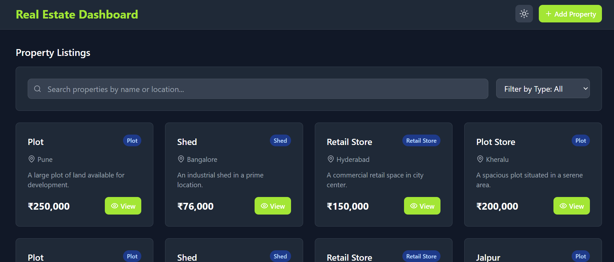

# Mini Property Listing Dashboard

A modern, responsive React TypeScript application for managing property listings with advanced filtering, search capabilities, and a beautiful user interface.

## 🚀 Features

### Core Functionality
- **Property Listings**: Display properties in a responsive card-based layout
- **Advanced Filtering**: Filter by property type (Plot, Shed, Retail Store, Apartment, House, Commercial)
- **Search Functionality**: Search properties by name or location
- **Add Property**: Create new properties with comprehensive form validation
- **Property Details**: View detailed property information in a modal with image gallery
- **Dark Mode**: Toggle between light and dark themes with persistent storage

### Technical Features
- **React Context API**: Centralized state management
- **TypeScript**: Full type safety and better developer experience
- **Responsive Design**: Optimized for mobile, tablet, and desktop
- **Local Storage**: Persistent dark mode preferences
- **Form Validation**: Real-time validation with error handling
- **Mock Data**: Pre-populated with sample property data

## 📸 Screenshots

Here are some preview images of the dashboard:

### 🖥️ Light Mode - Dashboard View


### 🌙 Dark Mode - Property Detail Modal


### ➕ Add Property Form


### ➕ view Details


## 🛠️ Tech Stack

- **Frontend**: React 18 + TypeScript
- **Styling**: Tailwind CSS
- **Icons**: Lucide React
- **Build Tool**: Vite
- **Linting**: ESLint with TypeScript support
- **Package Manager**: npm

## 📦 Installation

### Prerequisites
- Node.js (version 16 or higher)
- npm or yarn package manager

### Setup Instructions

1. **Clone the repository**
   ```bash
   git clone <repository-url>
   cd mini-property-dashboard
   ```

2. **Install dependencies**
   ```bash
   npm install
   ```

3. **Start the development server**
   ```bash
   npm run dev
   ```

4. **Open your browser**
   Navigate to `http://localhost:5173` to view the application

## 🏗️ Project Structure

```
src/
├── components/           # React components
│   ├── Header.tsx       # Main header with navigation
│   ├── FilterBar.tsx    # Search and filter controls
│   ├── PropertyCard.tsx # Individual property card
│   ├── PropertyGrid.tsx # Grid layout for properties
│   ├── AddPropertyForm.tsx # Form for adding new properties
│   └── PropertyModal.tsx   # Modal for property details
├── context/             # React Context providers
│   └── PropertyContext.tsx # Global state management
├── data/               # Mock data and constants
│   └── mockProperties.ts   # Sample property data
├── types/              # TypeScript type definitions
│   └── property.ts     # Property-related types
├── App.tsx            # Main application component
├── main.tsx           # Application entry point
└── index.css          # Global styles and Tailwind imports
```

## 🎨 Design System

### Color Palette
- **Primary**: Blue (#3B82F6) - Used for buttons, links, and accents
- **Secondary**: Emerald (#10B981) - Success states and highlights
- **Accent**: Amber (#F59E0B) - Warnings and special elements
- **Neutral**: Gray scale for text and backgrounds
- **Dark Mode**: Comprehensive dark theme support

### Typography
- **Headings**: Bold weights with proper hierarchy
- **Body Text**: Regular weight with 150% line height
- **UI Elements**: Medium weight for better readability

### Spacing
- **8px Grid System**: Consistent spacing throughout the application
- **Responsive Breakpoints**: Mobile-first approach with proper scaling

## 🔧 Available Scripts

- `npm run dev` - Start development server
- `npm run build` - Build for production
- `npm run preview` - Preview production build
- `npm run lint` - Run ESLint for code quality

## 📱 Responsive Design

The application is fully responsive and optimized for:
- **Mobile**: Single column layout with touch-friendly interactions
- **Tablet**: Two-column grid with optimized spacing
- **Desktop**: Multi-column grid (up to 4 columns) with hover effects
- **Large Screens**: Maximum width container with centered content

## 🌙 Dark Mode

- **Toggle**: Available in the header for easy access
- **Persistence**: Theme preference saved to localStorage
- **Smooth Transitions**: Animated theme switching
- **Complete Coverage**: All components support both themes

## 📋 Property Management

### Adding Properties
- **Form Validation**: Real-time validation with error messages
- **Required Fields**: Name, type, location, price, and description
- **Optional Fields**: Detailed description and image URL
- **Default Images**: Fallback to stock photos when no image provided

### Property Types
- Plot
- Shed
- Retail Store
- Apartment
- House
- Commercial

### Filtering & Search
- **Type Filter**: Dropdown to filter by property type
- **Search**: Real-time search across property names and locations
- **Combined Filters**: Search and type filters work together
- **No Results State**: Helpful message when no properties match filters

## 🗺️ Maps Integration

The application includes placeholder functionality for Google Maps integration:
- **Coordinates**: Properties can store latitude and longitude
- **External Links**: "View on Maps" buttons open Google Maps
- **Fallback**: Location-based search when coordinates unavailable

## 🔮 Future Enhancements

- **API Integration**: Replace mock data with real API endpoints
- **Image Upload**: Allow users to upload property images
- **Advanced Filters**: Price range, date filters, and more
- **Sorting Options**: Sort by price, date, location, etc.
- **Property Editing**: Edit existing property information
- **User Authentication**: User accounts and property ownership
- **Favorites**: Save favorite properties
- **Property Comparison**: Compare multiple properties side-by-side

## 🤝 Contributing

1. Fork the repository
2. Create a feature branch (`git checkout -b feature/amazing-feature`)
3. Commit your changes (`git commit -m 'Add amazing feature'`)
4. Push to the branch (`git push origin feature/amazing-feature`)
5. Open a Pull Request

## 📄 License

This project is licensed under the MIT License - see the LICENSE file for details.

## 🙏 Acknowledgments

- **Pexels**: Stock photos for property images
- **Lucide**: Beautiful icon library
- **Tailwind CSS**: Utility-first CSS framework
- **React Team**: For the amazing React library

## 📞 Support

If you have any questions or need help with the project, please:
1. Check the existing issues on GitHub
2. Create a new issue with detailed information
3. Provide steps to reproduce any bugs

---

**Built with ❤️ using React, TypeScript, and Tailwind CSS**